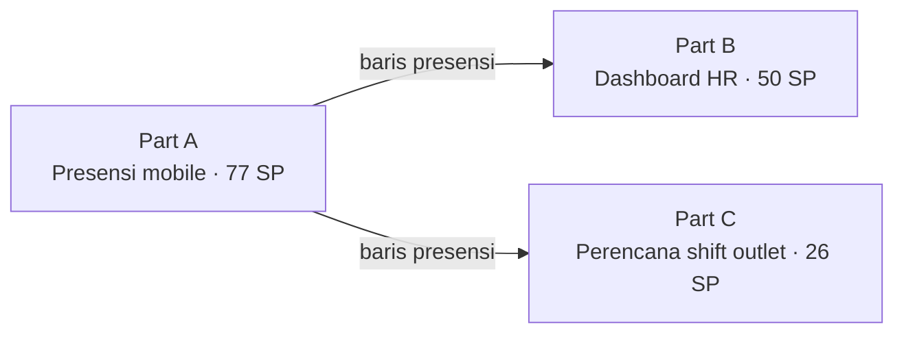

# PM Project 01 — Mengoordinasikan Rollout Presensi GPS 3 Track Lintas Sistem Mobile, HR, dan Outlet

**Proyek APM — 04 · Chocoa Online Attendance**

Assistant PM untuk rollout Online Attendance Dea Bakery — menyusun urutan 153 story point lintas tiga sistem yang saling bergantung, menulis batasan cakupan yang membuat tim desain dan engineering bisa bergerak tanpa berdebat ulang soal batasan, serta menegakkan garis tegas antara status live dan berjalan di setiap laporan.

| | |
|---|---|
| **Peran** | Assistant Project Manager |
| **Durasi** | Jul 2026 – Berjalan (Part A live 4 Agu) |
| **Tim** | PM, Mobile/Flutter, Backend, Integration |
| **Produk** | Chocoa Online Attendance |
| **Tag** | Assistant PM · Cross-team Coordination · Scope Management · Sprint Sequencing · Ongoing Project |

---

## TL;DR

- **Masalah:** 1.000+ karyawan Dea Bakery di 56+ outlet bergantung pada mesin fingerprint yang terikat lokasi untuk presensi — buntu untuk tim flying, area manager, auditor, dan tim lapangan IT/GS.
- **Risiko koordinasi:** Tidak ada batasan cakupan tertulis, tiga track menulis ke satu database bersama, dan presensi menjadi dasar penggajian.
- **Peran saya:** Menyusun urutan 153 story point lintas 3 track, menulis dokumen batasan cakupan (§0), dan menjaga disiplin pelaporan **live vs. berjalan**.
- **Pelajaran utama:** Batasan cakupan tertulis makin bernilai ketika proyek melibatkan banyak tim, dan aturan "potensi, bukan proyeksi" menjaga rollout yang separuh sudah produksi tetap jujur ke leadership.

---

## 1. Konteks

1.000+ karyawan Dea Bakery di 56+ outlet bergantung pada mesin fingerprint yang terikat lokasi untuk presensi — sistem yang buntu untuk siapa pun yang tidak duduk di satu tempat sepanjang hari: tim flying, area manager, auditor, tim lapangan IT/GS.

> Peran saya adalah mengoordinasikan rollout lintas tiga sistem yang dibangun oleh empat tim — menyusun urutan pekerjaan, menjaga cakupan agar tidak melebar di tengah build, dan memastikan setiap status report membedakan dengan jelas mana yang sudah live dan mana yang masih dalam sprint.

---

## 2. Masalah

Tiga risiko koordinasi berdiri di antara desain yang baik dan sistem yang bisa dipercaya leadership:

1. 📋 **Tidak Ada Batasan Cakupan Tertulis**
   Setiap pertanyaan baru soal radius GPS, aturan cuti, atau pengecualian staf lapangan membuka ulang debat desain yang sama — tidak ada garis yang sudah disepakati soal mana yang sudah diputuskan dan mana yang masih terbuka.
2. 🔗 **Tiga Track, Satu Database Bersama**
   Aplikasi mobile, dashboard HR, dan perencana outlet semuanya menulis ke tabel yang sama — perubahan skema atau keterlambatan di satu track bisa diam-diam memblokir pekerjaan sprint di track lain.
3. 💰 **Presensi Jadi Dasar Penggajian**
   Kesalahan langkah di rollout ini bukan cuma merusak satu layar — ia berisiko ke akurasi penggajian, sehingga update status harus akurat, tidak boleh optimis berlebihan.

---

## 3. Yang Saya Koordinasikan

Tiga mekanisme koordinasi yang menjaga rollout multi-tim dan multi-sistem ini tetap berjalan tanpa kehilangan kendali atas cakupan maupun akurasi:

### 01 — Dokumen Batasan Cakupan (§0)

Sebelum desain dimulai, menuliskan lebih dulu Masalah, Kenapa Sekarang, Siapa yang Kena, Batas Keras, dan Di Luar Cakupan — dengan aturan eksplisit bahwa begitu §0 disepakati, tim bisa mendesain bebas di dalamnya tanpa perlu mengecek ulang batasan di setiap keputusan.

### 02 — Menyusun Urutan 153 Story Point Lintas 3 Track

Membagi rollout jadi track yang diurutkan berdasarkan dependensi:

| Track | Cakupan | Story point |
|---|---|---:|
| Part A | Penangkapan presensi mobile | 77 SP |
| Part B | Dashboard HR | 50 SP |
| Part C | Perencana shift outlet | 26 SP |

Mobile dirilis lebih dulu karena review HR dan perencanaan shift sama-sama bergantung pada baris presensi yang dihasilkannya.

### 03 — Disiplin Pelaporan Live vs. Berjalan

Setiap update ke stakeholder menarik garis tegas antara yang sudah ada di produksi dan yang masih dalam sprint — termasuk menahan estimasi penghematan biaya ±Rp16,5 juta/tahun sebagai "potensi", bukan "proyeksi", sampai seluruh gerbang produksi di ketiga track tertutup.

---

## 4. Ritme Koordinasi

| Kapan | Aktivitas |
|---|---|
| **Senin** | Sync lintas track — Mobile, Backend, dan Integration melaporkan status sprint terhadap rencana 153 SP |
| **Rabu** | Cek dependensi — flag apa pun di satu track yang berpotensi memblokir track lain sebelum benar-benar terjadi |
| **Jumat** | Update status ke stakeholder — pemisahan tegas "live" vs. "berjalan" per track, tanpa membulatkan ke atas |
| **Per gerbang** | Review checklist go-live sebelum track mana pun berpindah dari sprint ke produksi |

---

## 5. Cakupan

### Masuk Cakupan

- ✓ Dokumen batasan cakupan (§0)
- ✓ Peta dependensi lintas 3 sistem
- ✓ Penyusunan urutan sprint (153 SP total)
- ✓ Checklist gerbang go-live untuk Part A
- ✓ Pelaporan status ke stakeholder

### Di Luar Cakupan

- → **Desain UI/UX di ketiga sistem** — Dipegang terpisah sebagai design track
- → **Penonaktifan mesin fingerprint** — Terhambat sampai Part B & C go-live
- → **Implementasi backend/API** — Dipegang tim engineering

---

## 6. Status

Status per siklus pelaporan terakhir — dirilis bertahap, bukan sekaligus:

**Status per Track** · 153 SP total

| Track | Progres | Catatan |
|---|---:|---|
| Part A — Aplikasi Mobile | 100% | 77 SP · live |
| Part B — Dashboard HR | 36% | 50 SP · sprint 1/3 |
| Part C — Perencana Outlet | 50% | 26 SP · sprint 1/2 |

---

## 7. Dampak

| Metrik | Arti |
|---|---|
| **56+** | Outlet live dengan presensi mobile Part A |
| **153** | Story point tersusun lintas 3 track |
| **0** | Edit database tanpa audit sejak go-live |

---

## 8. Refleksi

Bagian tersulit dari rollout ini bukan salah satu track-nya — melainkan sambungan di antara ketiganya. Database yang dipakai bersama berarti satu keputusan di aturan cuti HR bisa diam-diam merusak logika overlay perencana outlet beberapa minggu kemudian kalau tidak dicek di titik sambungannya.

### Key Takeaway

Batasan cakupan yang tertulis justru makin bernilai ketika proyek melibatkan banyak tim, bukan makin tidak penting — itulah satu-satunya hal yang membuat empat tim bisa bergerak paralel tanpa negosiasi ulang setiap hari soal apa yang sudah diputuskan. Dan disiplin pelaporan itu terus bertambah nilainya: aturan "potensi, bukan proyeksi" yang sama yang saya bawa dari proyek sebelumnya menjaga rollout yang separuh sudah produksi dan separuh masih sprint tetap jujur ke leadership sepanjang jalan.
