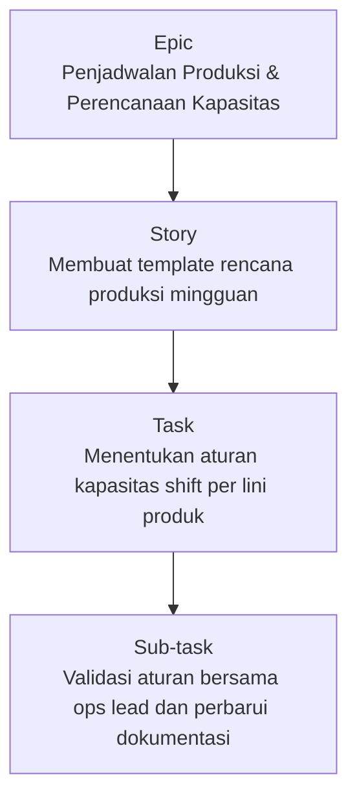
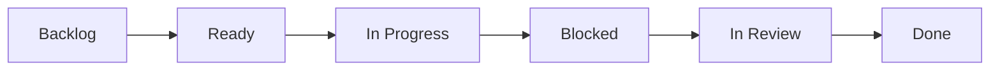

# PM Project 02 — Optimasi Alur Kerja Produksi

**Proyek 05 · Assistant PM — Alur Kerja Produksi Bakery**

Merapikan penjadwalan produksi bakery dan koordinasi tim untuk meningkatkan ketepatan waktu pengiriman serta mengurangi miskomunikasi.

| | |
|---|---|
| **Peran** | Assistant Project Manager |
| **Durasi** | 6–8 minggu |
| **Tim** | PM, 1 asisten PM, ops lead, engineer, stakeholder |
| **Produk** | Alur Kerja Produksi Bakery |
| **Tag** | Assistant PM · Workflow Optimization · Scheduling · Cross-functional Coordination |

---

## TL;DR

- **Masalah:** Penjadwalan dan koordinasi produksi sangat bergantung pada chat ad-hoc dan pencatatan manual. Seiring volume order meningkat, tim kehilangan visibilitas atas prioritas dan dependensi.
- **Pendekatan:** Ritme kerja dan sistem tracking yang lebih terstruktur — pekerjaan disusun dalam hierarki bergaya Jira dengan tipe issue, penamaan, dan workflow yang konsisten.
- **Peran saya:** Memegang lapisan eksekusi koordinasi untuk mendukung Project Manager — timeline, tracking tugas, notulen rapat, dan komunikasi lintas desainer, developer, dan stakeholder.
- **Pelajaran utama:** Pengungkit terbesarnya bukan menambah rapat, melainkan membuat pekerjaan terlihat dan tidak ambigu.

---

## 1. Ringkasan

Proyek ini berfokus mengoptimalkan alur kerja produksi untuk operasional bakery dengan meningkatkan visibilitas penjadwalan, tracking tugas, dan koordinasi lintas tim. Tujuannya membuat perencanaan produksi predictable dan lebih mudah dieksekusi sehari-hari.

---

## 2. Peran Saya (Assistant PM)

Saya mendukung Project Manager dengan memegang lapisan eksekusi koordinasi:

- Mengoordinasikan timeline proyek dan tracking tugas agar milestone tetap sesuai jadwal
- Menyimpan notulen rapat dan action item agar status proyek tetap terlihat jelas
- Memfasilitasi komunikasi antara desainer, developer, dan stakeholder
- Membantu mengurangi miskomunikasi dan mempercepat penyelesaian isu selama eksekusi
- Meningkatkan efisiensi alur kerja tim lewat rutinitas dan tooling yang konsisten

---

## 3. Masalah

Penjadwalan dan koordinasi produksi sangat bergantung pada chat ad-hoc dan pencatatan manual. Seiring volume order meningkat, tim kehilangan visibilitas atas prioritas dan dependensi.

Masalah yang umum terjadi:

- Prioritas produksi harian tidak jelas dan sering berubah mendadak
- Tugas "macet" karena kepemilikan dan langkah berikutnya tidak eksplisit
- Hasil rapat tidak konsisten diterjemahkan jadi work item yang bisa dilacak
- Handoff lintas tim menyebabkan keterlambatan karena konteks atau requirement yang hilang

---

## 4. Yang Kami Tingkatkan

Kami memperkenalkan ritme kerja dan sistem tracking yang lebih terstruktur agar semua orang bisa melihat rencana, status, dan blocker sekilas pandang.

- Standardisasi rutinitas perencanaan mingguan dan harian
- Definisi milestone yang jelas dan checkpoint tracking
- Satu sumber kebenaran untuk tugas, pemilik, dan due date
- Jalur eskalasi yang lebih cepat untuk blocker dan perubahan prioritas

---

## 5. Cara Saya Mengelolanya (Format Jira)

Untuk mengelola perencanaan dan eksekusi, saya membantu menyusun pekerjaan dalam hierarki bergaya Jira, dengan tipe issue, penamaan, dan workflow yang konsisten.

### Hierarki issue

Epic → Story → Task/Sub-task (dengan pemilik, due date, dan acceptance criteria yang jelas).

| Tipe | Contoh |
|---|---|
| **Epic** | Penjadwalan Produksi & Perencanaan Kapasitas |
| **Story** | Membuat template rencana produksi mingguan |
| **Task** | Menentukan aturan kapasitas shift per lini produk |
| **Sub-task** | Validasi aturan bersama ops lead dan perbarui dokumentasi |

### Alur board (kolom)

Backlog → Ready → In Progress → Blocked → In Review → Done

| Kolom | Ketentuan |
|---|---|
| **Ready** | Sudah discope, pemilik ditentukan, due date ditetapkan |
| **Blocked** | Alasan blocker dicatat + langkah berikutnya + ETA |
| **In Review** | Review dan sign-off dari stakeholder/PM |

### Sprint / ritme kerja

- **Perencanaan mingguan:** mengonfirmasi prioritas, kapasitas, dan target milestone
- **Check-in harian:** meninjau "In Progress / Blocked" dan menugaskan ulang bila perlu
- **Review mingguan:** demo/ringkasan apa yang selesai, apa yang meleset, dan kenapa

### Format ticket (template)

Memakai struktur yang konsisten agar tugas actionable dan mengurangi bolak-balik.

| Field | Isi |
|---|---|
| **Summary** | Kata kerja + hasil (mis. "Tentukan aturan jadwal bake harian") |
| **Description** | Konteks + batasan + tautan ke notulen |
| **Acceptance criteria** | Daftar poin "selesai berarti…" |
| **Owner** | Satu DRI + kolaborator |
| **Due date** | Terikat ke milestone, bukan "kalau sempat" |

### Notulen rapat → aksi di Jira

Setelah setiap rapat, saya mencatat keputusan dan mengonversinya jadi ticket dengan pemilik dan tanggal. Ini memberi stakeholder visibilitas status yang jelas tanpa perlu follow-up tambahan.

---

## 6. Dampak

Hasil yang kami dorong lewat perencanaan dan koordinasi yang lebih jelas:

- Milestone proyek selesai sesuai jadwal lewat tracking dan follow-up yang terstruktur
- Miskomunikasi berkurang lewat satu sumber kebenaran dan kepemilikan yang eksplisit
- Penyelesaian isu lebih cepat lewat blocker yang terlihat dan rutinitas eskalasi
- Efisiensi alur kerja tim meningkat lewat perencanaan dan dokumentasi yang berulang

---

## 7. Refleksi

Pengungkit terbesarnya bukan menambah rapat — melainkan membuat pekerjaan terlihat dan tidak ambigu. Struktur Jira yang konsisten, kepemilikan yang jelas, dan follow-up yang disiplin menciptakan eksekusi yang lebih lancar dan alignment yang lebih baik lintas tim.
