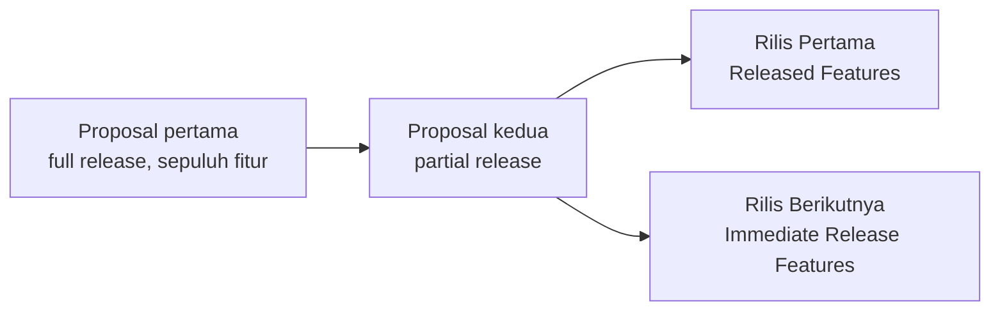

# PM Project 03 — Menyusun Proposal Kedua: Rilis Bertahap Fitur HRIS Personal Account

**Proyek APM — 01 · Dea Bakery HRIS — Personal Account**

Proyek pertama saya sebagai Assistant Project Manager di Dea Bakery — mengubah proposal full release yang tidak realistis jadi rencana partial release yang bisa dieksekusi tim kecil lintas Figma, frontend, backend, dan QA dari September hingga Desember 2024.

| | |
|---|---|
| **Durasi** | Sep – Des 2024 (proyek Assistant PM pertama) |
| **Tim** | 5 orang — Figma, Frontend, Backend, QA |
| **Peran** | Assistant Project Manager |
| **Produk** | Dea Bakery HRIS — Personal Account |
| **Tag** | Assistant PM · Release Planning · Figma · Cross-functional Coordination · HR Tech |

---

## TL;DR

- **Masalah:** Proposal pertama HRIS Personal Account mengusulkan merilis seluruh fitur sekaligus — tidak sesuai kapasitas tim, tanpa prioritas rilis, dan tanpa rencana eksekusi bulanan.
- **Solusi:** Proposal kedua berupa **partial release** — sepuluh fitur dipecah jadi dua kelompok, dengan satu PIC per tahap kerja per bulan dan rentang persentase progres per orang.
- **Dampak:** **6** fitur live di rilis pertama (bukan sepuluh sekaligus) dan **4** fitur dipetakan rapi untuk rilis berikutnya.
- **Pelajaran utama:** Keberanian menulis ulang proposal yang sudah disetujui begitu jelas tidak sesuai kapasitas tim — partial release terasa seperti mundur, tapi itu yang membuat rilis pertama benar-benar terjadi.

---

## 1. Konteks

September 2024 adalah pertama kalinya saya memegang peran Assistant Project Manager di Dea Bakery. Proposal pertama untuk sistem HRIS (Personal Account) — payslip, cuti, SPKL, voucher, hingga data karyawan — mengusulkan merilis seluruh fitur sekaligus.

> Peran saya adalah menulis ulang rencana itu jadi proposal kedua: rilis bertahap yang benar-benar bisa dieksekusi lima orang, lalu mengoordinasikan siapa mengerjakan apa dari bulan ke bulan sampai rilis pertama tercapai.

---

## 2. Masalah

Tiga celah yang membuat proposal pertama sulit dieksekusi:

| | Celah | Deskripsi |
|---|---|---|
| 📦 | **Full Release Tidak Sesuai Kapasitas Tim** | Proposal pertama mencakup sepuluh fitur sekaligus — payslip & BPJS, cuti, SPKL, voucher, Quran, data karyawan, chat, penilaian karyawan, Dea Woman — padahal tim frontend dan backend hanya diisi 2–3 orang dengan porsi kerja yang harus dibagi |
| 🎯 | **Tidak Ada Prioritas Rilis** | Tanpa garis pemisah, tim berisiko mengerjakan sepuluh fitur paralel tanpa arah — memperlambat semuanya alih-alih menuntaskan yang paling dibutuhkan karyawan lebih dulu |
| 🗓️ | **Rencana Eksekusi Bulanan Belum Ada** | Proposal pertama cuma daftar fitur — belum memetakan siapa mengerjakan prototyping, siapa verifikasi, siapa build, siapa testing, atau kapan masing-masing harus selesai |

---

## 3. Yang Saya Susun

Tiga hal yang saya susun untuk mengubah proposal jadi rencana yang bisa dieksekusi:

### 01 — Proposal Kedua: Partial Release

Memecah sepuluh fitur jadi dua kelompok: **Released Features** (Slip Gaji & BPJS, Izin Cuti, SPKL, Voucher/Beras/Saudara Asuh, Quran tanpa dashboard, Data Karyawan) sebagai prioritas rilis pertama, dan **Immediate Release Features** (Chats, Al-Quran Full Feature, Penilaian Karyawan, Dea Woman) yang disusun untuk rilis berikutnya.

### 02 — Person-in-Charge per Bulan

Memetakan satu pemilik yang jelas untuk setiap tahap kerja per bulan — dari Figma prototyping di Oktober, build frontend/backend di November, sampai testing dan finishing di Desember — sehingga tidak ada fitur yang berjalan tanpa penanggung jawab.

### 03 — Progress Percentage per Orang

Setiap PIC diberi rentang persentase kerjanya sendiri (mis. 1%–30%, 40%–100%) sehingga saya bisa melihat siapa yang mepet target dan siapa yang masih di tahap awal, tanpa menunggu laporan status manual.

---

## 4. Rencana Eksekusi per Bulan

Dari proposal ke eksekusi — setiap bulan punya PIC dan tahap kerja yang jelas:

**Oktober 2024**

| Nama | Tugas |
|---|---|
| Fajriwati Qoyyum Rizqini | Figma Prototyping |
| Ilham Muhammad Waspada | Personal Account Verification |

**November 2024**

| Nama | Tugas |
|---|---|
| Nurrahmah Juniar Djazuli | Frontend Template (40% – 100%) |
| Gilby Dhilega Yodiaz | Frontend (1% – 30%) |
| Muhammad Dio Reyhans | Backend (1% – 30%) |

**Desember 2024**

| Nama | Tugas |
|---|---|
| Nurrahmah Juniar Djazuli | Testing |
| Gilby Dhilega Yodiaz | Finishing |
| Ilham Muhammad Waspada | Testing |
| Muhammad Dio Reyhans | Finishing |

---

## 5. Cakupan Rilis

### Rilis Pertama (Released Features)

- ✓ Slip Gaji & BPJS
- ✓ Izin Cuti
- ✓ SPKL
- ✓ Voucher, Beras, dan Saudara Asuh
- ✓ Quran (No Dashboard)
- ✓ Data Karyawan

### Rilis Berikutnya (Immediate Release Features)

- → Chats — Menyusul di rilis kedua
- → Al-Quran Full Feature — Menyusul di rilis kedua
- → Penilaian Karyawan — Menyusul di rilis kedua
- → Dea Woman — Menyusul di rilis kedua

---

## 6. Dampak

| Metrik | Arti |
|---|---|
| **6** | Fitur live di rilis pertama, bukan sepuluh sekaligus |
| **4** | Fitur dipetakan rapi untuk rilis berikutnya |
| **Sep 2024** | Titik awal karier saya sebagai Assistant PM |

---

## 7. Refleksi

Pelajaran pertama saya sebagai Assistant PM bukan soal tool atau template — melainkan keberanian menulis ulang proposal yang sudah disetujui begitu jelas tidak sesuai kapasitas tim. Partial release terasa seperti mundur, tapi itu yang membuat rilis pertama benar-benar terjadi.

**Key Takeaway:** Memisahkan "harus rilis sekarang" dari "boleh menyusul" adalah bentuk paling sederhana dari batasan cakupan — pola yang sama yang kemudian saya tulis lebih formal sebagai dokumen §0 di proyek Online Attendance. Prinsipnya sudah ada sejak proyek pertama ini, hanya belum punya nama.
