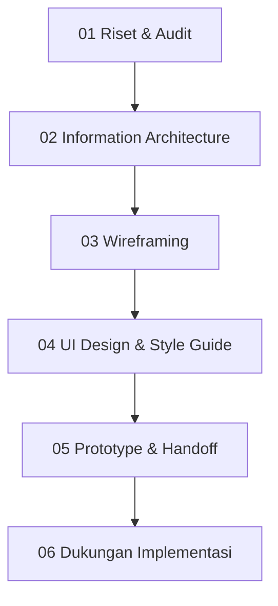

# Project 03 — Menata Ulang Website Resmi Brand Bakery Lokal

**Proyek 03 · Redesign Website Dea Bakery**

Redesign website Dea Bakery dari yang tidak konsisten dan sulit dinavigasi menjadi sistem visual yang kohesif, mudah di-maintain, dan langsung menyampaikan brand value kepada user.

| | |
|---|---|
| **Peran** | UI/UX Designer · UX Writer |
| **Durasi** | 4 Minggu |
| **Tim** | 1 Designer, 2 Developer |
| **Tools** | Figma · Elementor · Jira |
| **Tags** | UI Design · Web Redesign · Information Architecture · UX Writing · Design System |

---

## TL;DR

- **Masalah:** Website tumbuh incremental tanpa design oversight — brand tidak konsisten antar halaman, informasi sulit ditemukan (3+ klik), konten tersebar tanpa hierarki, dan update kecil selalu butuh Developer.
- **Solusi:** Sistem visual terpadu (merah maroon + latar krem hangat + fotografi produk asli), navigasi baru yang memangkas pencarian jadi maks. 2 klik, dan struktur modular yang bisa dikelola Marketing sendiri di Elementor.
- **Hasil:** Website rilis sesuai deadline dengan enam halaman inti; informasi penting ditemukan dalam maks. 2 klik (sebelumnya 3+ klik); Marketing dapat update promo & konten tanpa Developer.
- **Pelajaran utama:** Redesign yang baik bukan tentang membuat sesuatu terlihat lebih bagus, tapi tentang memecahkan masalah yang tepat dengan cara yang bisa dipertahankan.

---

## 1. Ringkasan Proyek

Website Dea Bakery tumbuh secara incremental selama beberapa tahun tanpa design oversight. Setiap update menambahkan section, menu, dan halaman baru — tanpa struktur yang kohesif. Hasilnya: website yang terasa berantakan, sulit dinavigasi, dan tidak mencerminkan kualitas produk yang sebenarnya ditawarkan brand.

Redesign ini bukan sekadar "bikin lebih bagus" — tapi tentang **memecahkan masalah nyata**: navigasi yang membingungkan user, konten yang tersebar tanpa hierarki, dan struktur yang membuat tim Marketing selalu bergantung pada Developer untuk update kecil sekalipun.

### Project Brief

> "Redesign website agar mencerminkan brand secara profesional, membuat informasi mudah ditemukan dalam maks. 2 klik, dan memberi tim Marketing kemandirian mengelola konten tanpa bergantung pada developer setiap saat."

---

## 2. Tujuan

Dua perspektif tujuan yang harus diseimbangkan: apa yang bisnis butuhkan dari website ini, dan bagaimana experience yang seharusnya dirasakan oleh user.

### Tujuan Bisnis

- ✓ Menampilkan brand yang lebih profesional & modern
- ✓ Meningkatkan kepercayaan customer terhadap kualitas produk
- ✓ Menyediakan website yang mudah di-update oleh tim Marketing
- ✓ Mengurangi ketergantungan Developer untuk update harian
- ✓ Mendukung campaign & promo yang sedang berjalan

### Tujuan UX

- → Menemukan informasi dalam max 2 klik
- → Hierarki konten yang jelas dan mudah dibaca
- → Readability & konsistensi visual di seluruh halaman
- → Mobile-first — mayoritas user dari mobile
- → Struktur scalable untuk penambahan konten masa depan

---

## 3. Tanggung Jawab Saya

Di project ini saya mengerjakan tiga peran sekaligus — bukan karena pilihan, tapi karena ketiganya saling terhubung erat dan tidak bisa dipisahkan. Keputusan di satu area langsung mempengaruhi yang lain.

| 🎨 UI/UX Designer | 🗂️ Information Architect | ✍️ UX Writer |
|---|---|---|
| Audit visual & UX desain existing | Memetakan sitemap & navigasi lama | Menulis ulang heading & tagline |
| Menyusun ulang layout utama setiap halaman | Menyusun ulang struktur navigasi | Menyederhanakan microcopy di seluruh halaman |
| Membuat wireframe low-fi & high-fi | Menyatukan halaman duplikat | Menyesuaikan tone of voice brand |
| Membangun style guide (color, type, spacing) | Membuat kategori konten yang jelas | Membuat CTA yang actionable & spesifik |
| Membuat komponen reusable di Figma | | |

---

## 4. Masalah & Peluang

Audit desain existing mengungkap empat masalah struktural — masing-masing juga membuka peluang perbaikan yang konkret:

| | Masalah | → | Peluang |
|---|---|---|---|
| 🎨 | Brand tidak konsisten antar halaman | → | Sistem visual terpadu — brand terasa lebih kredibel & terpercaya |
| 🧭 | Informasi sulit ditemukan (3+ klik) | → | Navigasi baru memangkas pencarian jadi maks. 2 klik |
| 📑 | Konten tersebar tanpa hierarki | → | Struktur jelas — user langsung menemukan yang relevan |
| 🔧 | Update kecil selalu butuh Developer | → | Struktur modular — Marketing mandiri kelola konten |

### Pertanyaan Desain

> "Bagaimana website bisa mencerminkan brand secara konsisten, mudah ditemukan dalam 2 klik, dan mandiri dikelola tim non-teknis — dalam constraints Elementor?"

---

## 5. Proses Desain

Proses desain ini berlangsung dalam 4 minggu dengan timeline ketat — berjalan paralel dengan project internal lain. Struktur proses dibuat agar setiap fase menghasilkan output yang langsung digunakan di fase berikutnya, bukan dead end.

**01 — Riset & Audit**
Memeriksa struktur navigasi, kategori konten, performance & loading time, dan UX flow existing.
*Output: Laporan audit + daftar pain point*

**02 — Information Architecture**
Menyusun ulang sitemap berbasis 3 prinsip: Clarity, Findability, Scalability.
*Output: Sitemap baru + struktur navigasi*

**03 — Wireframing**
Membuat wireframe layout untuk halaman utama — hero, product page, promo, blog.
*Output: Wireframe low-fidelity per halaman*

**04 — UI Design & Style Guide**
Membangun sistem visual baru: color, typography, spacing, components reusable.
*Output: UI high-fidelity + Style guide*

**05 — Prototype & Handoff**
Menyusun prototype interaktif di Figma & menyiapkan handoff notes untuk developer.
*Output: Prototype clickable + dokumen handoff*

**06 — Dukungan Implementasi**
Mendampingi developer di Elementor, custom CSS ringan, review mobile responsif.
*Output: Website live sesuai jadwal*

---

## 6. Eksplorasi UI

Tidak ada keputusan desain yang dibuat tanpa alasan. Di setiap area kritis, saya menjalankan iterasi kecil sebelum menetapkan arah final — memastikan setiap pilihan bisa dipertanggungjawabkan secara UX maupun feasibility implementasi.

### Eksplorasi 01 — Sistem Warna

**Cara Berpikir**
Warna existing tidak mencerminkan brand bakery — terlalu generik dan tidak membangkitkan appetite. Pertanyaannya: warna apa yang bisa secara visual menyampaikan 'artisanal, warm, trustworthy' tanpa terasa klise?

**Eksplorasi**
Diuji beberapa arah warna primary sebelum menetapkan satu yang paling konsisten dengan brand mark Dea Bakery yang sudah ada — bukan warna baru yang lepas dari identitas lama.

> **Keputusan Final:** Dipilih merah maroon sebagai primary (navbar, CTA, badge diskon) dipasangkan dengan latar krem hangat — mempertahankan kesan hangat khas bakery sambil tetap terasa lebih solid dan branded dibanding versi lama.

### Eksplorasi 02 — Struktur Navigasi

**Cara Berpikir**
Navigasi lama punya banyak item tanpa hierarki. Saya perlu memahami: item mana yang paling sering diakses user? Apa yang bisa dikonsolidasikan tanpa kehilangan konten penting?

**Eksplorasi**
Struktur disederhanakan ke item-item inti yang mencerminkan kebutuhan utama pengunjung — mengenal brand, melihat menu, menemukan lokasi, dan membaca update — dengan dropdown ringan untuk sub-kategori yang masih dibutuhkan.

> **Keputusan Final:** Final: About (dropdown) · Our Menu (dropdown) · Our Service · Our Store · Career · Blog. Navbar sticky dengan warna primary solid agar selalu accessible dan langsung dikenali di setiap halaman.

### Eksplorasi 03 — Hero Layout

**Cara Berpikir**
Hero adalah first impression — di website lama, hero tidak memiliki satu pesan yang jelas. Bagaimana hero bisa langsung menyampaikan value proposition dan karakter brand dalam hitungan detik?

**Eksplorasi**
Setiap halaman diberi hero yang disesuaikan dengan tujuannya — hero produk dengan fotografi appetizing di halaman Menu, hero naratif di halaman About & CSR — bukan satu template hero generik dipakai ulang di semua halaman.

> **Keputusan Final:** Halaman Menu memakai hero fotografi produk close-up dengan tagline yang lebih personal ('Kenalan Yuk Sama Rasa Baru!') dan CTA filter kategori langsung di bawahnya.

### Eksplorasi 04 — Komponen Product Card

**Cara Berpikir**
Card produk perlu menyampaikan 3 hal cepat: gambar yang appetizing, badge diskon yang menonjol, dan nama produk yang jelas — dan harus bisa diduplikasi tim Marketing tanpa developer.

**Eksplorasi**
Iterasi mengarah ke card grid dengan foto produk asli berukuran besar sebagai fokus utama, dibanding layout list atau card padat berisi banyak elemen teks.

> **Keputusan Final:** Grid 4-kolom (desktop) dengan foto produk penuh, badge diskon merah di pojok, dan nama produk di bawah — filter kategori sebagai pill di atas grid untuk navigasi cepat antar varian.

---

## 7. Halaman Final

Enam halaman inti yang dirilis — dari homepage hingga program CSR — masing-masing dengan hero dan struktur konten yang disesuaikan dengan tujuannya sendiri.

**Homepage**

Hero carousel, Awal Mula Kami, Our Latest Blogs, Dea Promo, Our Popular After Meal, Order From App, Dea Friends, Our Social Media.

**About Us**

Discover Who We Are, We Are Dea Family, Certification & Achievement (Halal, BPOM, MURI), Our Commitment.

**Our Story — Company Timeline**

Perjalanan brand dari 2001 hingga ekspansi nasional 2025.

**Our Menu**

Hero produk, filter kategori, dan grid produk dengan badge diskon.

**Our Store**

Pencarian lokasi toko dengan kartu alamat & jam buka.

**CSR Program**

Tiga pilar kontribusi sosial dan pencapaian rekor MURI.

---

## 8. Deliverable

Tiga deliverable utama yang dihasilkan dari project ini — masing-masing punya tujuan yang berbeda dalam lifecycle project.

### Deliverable 1 — Sistem Visual

Merah maroon sebagai warna primary — dipakai konsisten di navbar, CTA, dan badge diskon di seluruh halaman — dipasangkan dengan latar krem hangat dan fotografi produk asli sebagai elemen visual utama, menggantikan placeholder generik di versi lama.

- Navbar & CTA konsisten
- Fotografi produk asli
- Badge diskon standar
- Card component reusable

### Deliverable 2 — Final UI (Page Sections)

| Halaman | Section | Status |
|---|---|---|
| **Homepage** | Hero carousel · Awal Mula Kami · Our Latest Blogs · Dea Promo · Our Popular After Meal · Order From App · Dea Friends · Our Social Media | Dirilis |
| **About Us** | Our Mission · We Are Dea Family · Certification & Achievement · Our Commitment | Dirilis |
| **Our Story** | Company Timeline 2001–2025 | Dirilis |
| **Our Menu** | Hero produk · Filter kategori · Product grid dengan badge diskon | Dirilis |
| **Our Store** | Pencarian lokasi · Kartu toko (alamat, jam buka) | Dirilis |
| **CSR Program** | 3 Dasar Kontribusi Sosial · Pencapaian Rekor MURI | Dirilis |

### Deliverable 3 — Prototype

Prototype interaktif dibuat di Figma untuk mensimulasikan navigasi antar halaman dan validasi user flow sebelum handoff ke developer.

| | Komponen | Deskripsi |
|---|---|---|
| 🔗 | **Alur Navigasi** | Simulasi navigasi dari Homepage → Our Menu → Our Store → About Us |
| 📱 | **Responsivitas Mobile** | Prototype mobile view untuk validasi layout di layar kecil |
| 📋 | **Catatan Handoff** | Anotasi spacing, color tokens, dan component behavior untuk developer |

> **Cakupan prototipe:** Fokus pada user flow utama — menemukan produk, mengakses promo, dan menghubungi toko. Interaksi micro-animation tidak diprototype karena constraint Elementor.

---

## 9. Tantangan

Setiap project punya hambatan — yang membedakan adalah bagaimana hambatan itu direspons. Berikut empat challenge terbesar di project ini, dan cara saya mengatasinya.

### 01 — Keterbatasan Grid Elementor

- **Konteks:** Elementor tidak mendukung CSS grid presisi seperti Figma. Layout multi-kolom yang kompleks tidak bisa dibuat native.
- **Solusi:** Desain disederhanakan ke kolom standar (1/2/3 kolom). Custom CSS ringan ditambahkan hanya untuk spacing dan alignment yang tidak bisa dicapai native.
- **Pembelajaran Kunci:** *Designing 'buildable' adalah skill tersendiri. Saya belajar mendesain dalam constraint tools, bukan melawan mereka.*

### 02 — Responsivitas Mobile Tidak Stabil

- **Konteks:** Elemen berubah presisi di mobile view Elementor — spacing dan font size sering tidak konsisten antar device.
- **Solusi:** Pendekatan mobile-first diterapkan dari awal. Setiap section di-review di 3 breakpoint (mobile, tablet, desktop). Manual override di beberapa elemen kritis.
- **Pembelajaran Kunci:** *Mobile-first bukan hanya filosofi UX — di Elementor, ini juga strategi implementasi untuk menghindari rework.*

### 03 — Timeline Cepat vs. Kualitas Desain

- **Konteks:** Project berjalan paralel dengan beberapa project internal lain. Marketing butuh rilis cepat, tapi saya tidak mau mengorbankan konsistensi sistem.
- **Solusi:** Prioritas dikerjakan berdasarkan dampak: navigasi & homepage terlebih dahulu (high-traffic), halaman dalam (lower priority). Style guide dibuat di awal agar semua page konsisten tanpa review per-elemen.
- **Pembelajaran Kunci:** *Style guide adalah force multiplier. Dengan sistem yang solid di awal, kecepatan eksekusi di halaman berikutnya meningkat signifikan.*

### 04 — Otonomi Tim Marketing

- **Konteks:** Salah satu goal project adalah Marketing bisa update konten mandiri. Tapi setiap komponen yang 'terlalu custom' sulit diduplikasi tanpa developer.
- **Solusi:** Setiap section dirancang sebagai 'block' yang bisa diduplikasi di Elementor. Internal guide singkat dibuat untuk Marketing — cara update promo, tambah produk, dan edit blog tanpa sentuh kode.
- **Pembelajaran Kunci:** *Designing for the maintainer adalah bagian dari design deliverable — bukan afterthought.*

---

## 10. Dampak

Website berhasil rilis sesuai deadline. Dampak yang dirasakan mencakup tiga dimensi: user experience, operasional bisnis, dan efisiensi maintenance.

### Dampak UX

| Metrik | Arti |
|---|---|
| **≤ 2 klik** | Informasi penting ditemukan dalam max 2 klik — dari sebelumnya 3+ klik |
| **↑ Konsistensi** | Brand terasa lebih modern & terpercaya — navigasi jadi intuitif |
| **↑ Mobile** | Layout responsif stabil di semua device — mobile-first approach berhasil |

### Dampak Bisnis

| Metrik | Arti |
|---|---|
| **On-time** | Website rilis sesuai deadline — kejar tayang terpenuhi |
| **Self-serve** | Marketing dapat update promo & konten tanpa Developer |
| **↑ Campaign** | Konten campaign dapat dipublikasikan tepat waktu |

### Dampak Teknis

| Metrik | Arti |
|---|---|
| **↓ Load time** | Page load lebih ringan dengan optimasi gambar WebP & minimalisasi plugin |
| **Modular** | Struktur modular memudahkan maintenance tanpa sentuh kode |
| **↑ Responsif** | Layout responsif lebih stabil di semua breakpoint device |

---

## 11. Refleksi

Yang paling berkesan dari project ini bukan hasil akhirnya — tapi cara berpikir yang harus digunakan selama prosesnya.

**Constraint sebagai alat berpikir:** Elementor bukan musuh — dia adalah constraint yang memaksa saya berpikir lebih disiplin tentang apa yang benar-benar perlu. Desain yang 'buildable' sama pentingnya dengan desain yang 'beautiful'.

**IA sebelum UI:** Perubahan paling berdampak di project ini bukan visual — tapi struktural. Merapikan navigasi dan menyatukan halaman duplikat memberikan UX value yang lebih besar dari warna atau font manapun.

**Desain untuk maintainer:** Membangun komponen modular dan panduan internal untuk Marketing adalah bagian dari design deliverable yang sama pentingnya dengan Figma file. Website yang bagus tapi tidak bisa di-maintain adalah aset yang akan cepat jadi liabilitas.

### Key Takeaway

Redesign yang baik bukan tentang membuat sesuatu terlihat lebih bagus — tapi tentang memecahkan masalah yang tepat dengan cara yang bisa dipertahankan. Memahami konteks bisnis, bekerja dalam constraint nyata, dan mendesain untuk orang yang akan maintain produk jauh setelah project selesai: itulah yang membuat redesign ini benar-benar berhasil.
