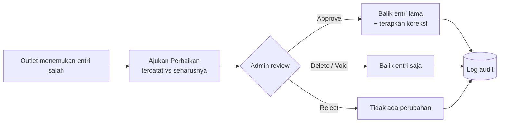

# Project 04 — Membenahi Sistem Pencatatan Bahan Baku untuk Menghilangkan Stok yang Salah Selamanya

**Proyek 04 · Chocoa POS — Modul Bahan Baku (Ingredient Management)**

Merancang modul Bahan Baku untuk Chocoa POS — sistem back-office Dea Bakery — dari halaman placeholder kosong menjadi sistem pencatatan stok factory-to-outlet yang terauditasi penuh. Desain dirombak dua kali dalam kurang dari dua minggu sebelum satu baris kode pun ditulis.

| | |
|---|---|
| **Peran** | Product Designer & Assistant Project Manager |
| **Durasi** | Mei 2026 — berjalan (target Sep 2026) |
| **Tim** | PM/FE, Backend, Integration, Mobile, Ops Reviewer |
| **Produk** | Chocoa POS — Modul Bahan Baku |
| **Jenis** | Internal tool · Data Model UX |
| **Status** | Ongoing — desain Milestone 1 selesai, belum live di outlet |

---

## TL;DR

- **Masalah:** Tidak ada sistem pencatatan bahan baku. Stok diperkirakan manual, restok lewat WhatsApp, dan kesalahan pencatatan tidak punya jalur koreksi formal.
- **Bukti:** 7 dari 21 kasus operasional Juni 2026 (**~33%**) berkaitan dengan bahan baku/stok.
- **Keputusan kunci:** Meninggalkan model dual-SKU dan langkah "konversi" eksplisit demi sistem **satuan per-bahan** — menghapus satu langkah manual penuh dari setiap alur outlet.
- **Pelajaran utama:** Jangan bangun infrastruktur paralel kalau yang sudah ada bisa dipakai ulang, dan "benar secara teknis" belum tentu "natural dipakai."

---

## 1. Konteks Bisnis

Chocoa mengoperasikan pabrik pusat dan jaringan outlet yang mengonsumsi puluhan bahan baku — tepung, gula, coklat bubuk, dan lainnya — setiap hari. Chocoa POS sudah matang di sisi penjualan: kartu stok produk, buku besar, dan laporan semuanya berfungsi baik. Tapi **tidak ada modul setara untuk bahan baku**. Menu navigasinya sudah ada — hanya saja membuka halaman placeholder kosong.

Saya memegang modul ini end-to-end sebagai Product Designer sekaligus Assistant Project Manager: information architecture, data-model UX, alur transaksi, spesifikasi layar, dan validasi lintas-tim dengan backend maupun frontend engineering.

---

## 2. Masalah

Belum ada sistem pencatatan bahan baku sama sekali:

- Level stok diperkirakan **manual**.
- Restok dikoordinasikan lewat **WhatsApp**.
- Kesalahan pencatatan pemakaian **tidak punya jalur koreksi formal** — entri yang salah tetap salah selamanya.

Data kasus operasional riil dari Juni 2026 membuat biaya dari celah ini konkret.

### Log Kasus Operasional — Juni 2026 (21 kasus, data lapangan riil)

| Kategori kasus | Jumlah | % | Terkait bahan baku/stok |
|---|---:|---:|:---:|
| Perbaikan stok | 6 | 29% | ● |
| Perbaikan poin / member | 4 | 19% | |
| Perbaikan buku besar | 3 | 14% | |
| Perbaikan piutang / buku besar | 2 | 10% | |
| Akses / printer / setting | 2 | 10% | |
| Konversi item | 1 | 5% | ● |
| OVE vs kebijakan | 1 | 5% | |
| Input item baru | 1 | 5% | |
| Penambahan voucher | 1 | 5% | |

Kasus terkait bahan baku/stok (●) berjumlah **7 dari 21 (33%)** dari total beban kasus bulanan — inilah target yang ingin ditutup oleh modul ini.

### How Might We

> Bagaimana kami bisa memberi outlet cara resmi untuk mencatat, mengoreksi, dan mempertanggungjawabkan bahan baku — tanpa membebani mereka dengan langkah kerja tambahan yang tidak natural bagi cara mereka bekerja sehari-hari?

---

## 3. Discovery

Ini adalah internal tooling, bukan produk konsumen, sehingga discovery bertumpu pada tiga sumber, bukan wawancara pengguna formal:

1. **Tinjauan teknis** atas skema produksi.
2. **Log kasus operasional** (di atas).
3. **Tiga putaran review spec lintas-fungsi** — karena tidak ada prototipe interaktif yang bisa diuji ke outlet sebelum build, masing-masing putaran menghasilkan spec yang dirombak total.

### Titik balik: tinjauan skema

Draf pertama (v1.0) mengusulkan sembilan tabel standalone, termasuk `stock_ledger` custom. Meninjau skema produksi yang sudah berjalan bersama PM/Frontend owner menunjukkan Chocoa **sudah punya** logging kelas produksi — `sy_logs`, `sy_logs_konversi`, dan `pos_stok_outlet` — dengan reporting view yang sudah teruji di produksi.

Membangun ledger paralel akan menduplikasi infrastruktur yang sudah berfungsi baik dan membuat setiap laporan yang mengandalkan view itu buta terhadap data bahan baku.

### Riwayat Review Spec

| Versi | Tanggal | Apa yang berubah | Kenapa |
|---|---|---|---|
| v1.0 | 21 Mei | Draf awal — 9 tabel standalone, model dual-unit per bahan | Baseline proposal |
| v2.0 | 22 Mei | Refactor total — menumpang infrastruktur produksi yang sudah ada, bukan ledger custom | Menghindari duplikasi audit trail yang sudah berfungsi di produksi |
| v3.0 | 29 Mei | Sistem satuan per-bahan menggantikan aturan konversi eksplisit | Langkah "konversi" eksplisit terasa seperti tugas admin tambahan yang tidak natural bagi outlet |

---

## 4. Ideation & Model Satuan

Pertanyaan terbuka terbesar bukan soal ledger — tapi **bagaimana outlet mencatat bahan yang datang dalam satu satuan (karung) tapi dipakai dalam satuan lain (gram)**. Dua pendekatan dieksplorasi.

### Dieksplorasi — Model Dual-SKU (v1.0/v2.0, ditinggalkan)

Setiap varian satuan dari satu bahan menjadi item terpisah — "Teh (Box)" dan "Teh (Pouch)" sebagai dua kode berbeda, dihubungkan lewat aturan konversi. Valid secara teknis, tapi:

- menggandakan item untuk setiap bahan yang dipakai dalam lebih dari satu satuan, dan
- memaksa outlet melewati langkah "konversi" eksplisit sebelum bisa mencatat pemakaian.

### Dipilih — Sistem satuan per-item dengan rasio implisit (v3.0)

Satu bahan = satu kode. Bahan itu sendiri mendefinisikan daftar satuan yang berlaku untuknya, masing-masing dengan rasio ke satuan dasarnya. Ini menghilangkan satu langkah manual penuh dari setiap alur — Item Masuk, Item Keluar, dan Produksi mengikuti pola yang sama:

> **Pilih Bahan → Pilih Satuan → Masukkan Jumlah**

### Contoh: Tepung Terigu

| Satuan | Rasio ke satuan dasar | Base? | Default? |
|---|---:|:---:|:---:|
| Gram | 1 | Ya | |
| Kg | 1.000 | | Ya |
| Karung | 25.000 | | |

Input outlet `2 Karung` → otomatis tersimpan sebagai `50.000 Gram`. Outlet tidak pernah menyentuh layar konversi — mereka cukup memilih satuan yang mereka pegang secara fisik.

---

## 5. Key Design Solutions

Empat keputusan yang paling menentukan — masing-masing bisa ditelusuri langsung ke celah spesifik yang muncul saat discovery, bukan sekadar best practice generik.

### Keputusan 01 — Manajemen Satuan dengan Live Preview Rasio

- **Challenge:** Kesalahan rumus konversi (misalnya rasio yang salah hitung) sudah muncul di log kasus Juni — satu typo pada rasio bisa merusak diam-diam setiap transaksi yang dibangun di atasnya.
- **Keputusan:** Layar dua panel: daftar bahan di kiri, tabel satuan bahan terpilih di kanan. Saat menambah satuan baru, sistem menampilkan live preview — "1 Karung = 50.000 Gram" — sebelum disimpan.
- **Rationale:** Menangkap kesalahan rasio di titik input jelas jauh lebih murah daripada menangkapnya setelah stok sudah bergerak lewat puluhan transaksi.

### Keputusan 02 — Guardrail Stok Negatif di Titik Kritis

- **Challenge:** Desain v2.0 mengizinkan stok negatif di semua alur, yang berarti sistem bisa mencatat sesuatu yang secara fisik tidak mungkin terjadi.
- **Keputusan:** v3.0 memblokir aksi simpan di dua titik yang secara fisik tidak mungkin stoknya negatif — **Item Keluar** dan **Produksi**. Jika pengurangan akan membuat bahan manapun negatif, tombol konfirmasi terkunci dan baris bermasalah disorot lengkap dengan detail defisitnya.
- **Rationale:** Guardrail yang dipasang sebelum transaksi tersimpan mencegah data buruk; peringatan setelah kejadian hanya mendokumentasikannya.

### Keputusan 03 — Produksi Multi-Resep dengan Panel Konfirmasi Gabungan

- **Challenge:** Outlet menjalankan beberapa resep per shift. Menjalankannya satu per satu berarti tidak ada visibilitas apakah stok bahan cukup untuk rencana produksi sehari penuh.
- **Keputusan:** Outlet bisa mengantrikan beberapa resep sekaligus. Sistem menggabungkan seluruh pengurangan bahan lintas resep ke satu tabel pratinjau — bahan yang sama otomatis dijumlahkan — dengan **SISA STOK** ditampilkan hijau (aman) atau kuning (menipis) sebelum dikonfirmasi.
- **Rationale:** Menjawab pertanyaan paling umum outlet di awal shift — "apakah bahan kita cukup untuk hari ini?" — langsung dalam satu layar, bukan tersirat di beberapa layar terpisah.

### Keputusan 04 — Perbaikan Transaksi: Jalur Koreksi Formal dan Bisa Diaudit

- **Challenge:** Jawaban langsung untuk masalah inti: tidak ada mekanisme koreksi, sehingga entri stok yang salah tetap salah selamanya.
- **Keputusan:** Outlet — pihak yang sebenarnya tahu nilai yang benar — melaporkan apa yang tercatat dan apa yang seharusnya. Admin lalu berperan sebagai gatekeeper:
  - **Approve** — balik + terapkan koreksi
  - **Delete/Void** — balik saja
  - **Reject** — tidak ada perubahan

  Setiap keputusan meninggalkan jejak log yang bisa ditelusuri.
- **Rationale:** Menggantikan pola berulang di log kasus berupa "diperbaiki manual lalu didiamkan" dengan jalur formal yang punya pemilik dan jejak audit.

---

## 6. Validasi Lintas-Fungsi

Tanpa prototipe yang bisa diuji ke pengguna, validasi terjadi lewat siklus review spec bersama PM/Frontend owner dan tim backend.

| Temuan | Masalah | Tindakan |
|---|---|---|
| Model dual-SKU (v1.0/v2.0) | Menciptakan item duplikat untuk setiap bahan yang dipakai dalam beberapa satuan; outlet harus "mengonversi" secara eksplisit sebelum mencatat pemakaian | Diganti sistem satuan per-item (v3.0) — satu kode, banyak satuan, konversi otomatis |
| Langkah konversi eksplisit terasa seperti tugas admin tambahan | Outlet harus memahami "membuka karung" sebagai transaksi terpisah dari "memakai bahan" — dua langkah untuk satu maksud | Layar Konversi dihapus total; setiap layar transaksi kini langsung menerima input dalam satuan apa pun yang didefinisikan |

---

## 7. Final UI & Design System

Lima layar inti berbagi satu pola interaksi yang sama — *Pilih Bahan → Pilih Satuan → Masukkan Jumlah* — sehingga staf hanya perlu belajar satu pola untuk semua alur.

| Layar | Untuk | UI Pattern | Status |
|---|---|---|---|
| Manajemen Satuan | Admin | Panel ganda + live preview rasio ("1 Karung = 50.000 Gram") | ✅ Done |
| Item Masuk | Outlet | Form batch multi-baris, unit chips per bahan | ✅ Done |
| Item Keluar | Outlet | Form batch + guardrail stok negatif, baris bermasalah disorot merah | ✅ Done |
| Transfer Stok | All Role | Pengiriman bahan antar outlet, alur status Diproses/Perbaikan/Disetujui sama seperti Item Masuk | ✅ Done |
| Pre-Adjustment | Leader | Antrean approval penyesuaian stok — Leader meninjau dan menyetujui sebelum koreksi diterapkan | ✅ Done |
| Manajemen Resep | Admin | Daftar adonan resep dengan "Sekali Pembuatan" sebagai deskriptor output ("1 Batch", "1 Loyang", "1 Kg") | ✅ Done |
| Produksi | Outlet | Antrean multi-resep + panel konfirmasi gabungan, sisa stok berwarna | 🔄 Berjalan |

### Galeri Layar

**Katalog Bahan Baku — Admin**

Master data bahan baku pabrik: kode item, satuan, harga per satuan, stok saat ini, status aktif/non-aktif. Tab kedua di halaman ini berisi Manajemen Satuan.

**Item Masuk — Tinjauan Admin Factory**

Pusat menerima dan mengevaluasi pengajuan Item Masuk dari Leader outlet, dengan status Diproses / Perbaikan / Disetujui / Ditolak.

**Item Keluar — Riwayat Harian (Leader)**

Leader mencatat dan meninjau riwayat item keluar harian per transaksi, lengkap dengan siapa yang mencatat dan total bahan.

**Transfer Stok — Pengiriman Antar Outlet**

Pengiriman bahan baku dari satu outlet ke outlet lain, memakai alur status yang sama seperti Item Masuk.

**Pre-Adjustment — Rekam Selisih Stok (Leader)**

Leader merekam selisih antara stok fisik dan catatan sistem per bahan — belum mengubah stok utama sampai disetujui Admin.

**Manajemen Resep — Konversi Bahan (Admin)**

Daftar adonan resep dengan kode massa dan "Sekali Pembuatan" sebagai deskriptor output ("1 Batch", "1 Loyang", "1 Kg").

### Design system

Dibangun di atas **DaisyUI** dengan brand theme kustom `dea` (26 token warna dipetakan), **Inter** untuk teks UI dan **JetBrains Mono** untuk angka stok serta kode transaksi agar mudah dipindai. Seluruh copy dalam Bahasa Indonesia dengan format tanggal `DD MMM YYYY`, dan setiap peringatan stok menipis/negatif selalu memasangkan ikon dan teks dengan warna — tidak pernah hanya mengandalkan warna.

---

## 8. Dampak & Progres Desain

Modul ini **belum live di outlet** — bagian ini melaporkan progres nyata yang sedang berjalan, bukan hasil pasca-rilis.

### Progres Desain (per September 2026)

**Milestone 1: 5/5** — Story desain Milestone 1 selesai: Manajemen Satuan, Item Masuk, Item Keluar, Transfer Stok, Pre-Adjustment.

### Target Dampak Operasional

| Metrik | Arti |
|---|---|
| **~33%** | Dari beban kasus operasional bulanan (7 dari 21) yang disasar modul ini |
| **13 fase** | Rencana rollout penuh — 57 task, 8–12 minggu pasca-fondasi |
| **1 gerbang** | End-to-end smoke test wajib + patch dua-baris pada view sebelum go-live |

---

## 9. Refleksi

**Jangan bangun infrastruktur paralel kalau yang sudah ada bisa dipakai ulang.** Draf pertama menghabiskan effort nyata untuk merancang sembilan tabel custom sebelum satu putaran tinjauan skema menunjukkan apa yang sistem sudah punya. Satu putaran review menghemat kompleksitas besar dan membuat modul baru ini otomatis mewarisi audit trail serta reporting yang sudah dipercaya tim.

**"Benar secara teknis" belum tentu "natural dipakai."** Model dual-SKU dengan konversi eksplisit (v2.0) valid sebagai data model, tapi memaksa outlet melewati langkah yang tidak mencerminkan cara mereka berpikir tentang stok fisik. Pindah ke sistem satuan per-item bukan soal menambah fitur — tapi soal menghapus satu langkah penuh dari alur kerja harian mereka.
