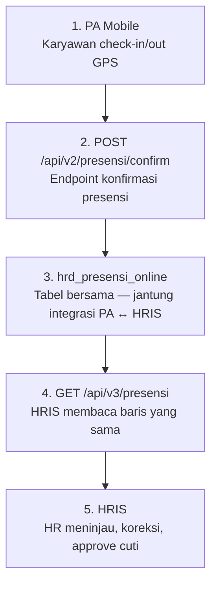
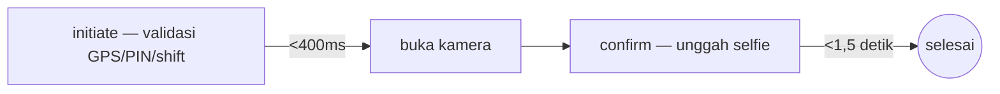

# Project 05 — Menyatukan Presensi GPS Lintas Tiga Sistem agar Bisa Dipercaya sebagai Dasar Penggajian

**Proyek 05 · Chocoa Online Attendance**

Kelanjutan dari fitur Presensi Online yang dirilis di Personal App Staff (Proyek 02) — proyek ini membangun sisi manajemen HR untuk data presensi itu: dashboard peninjauan & koreksi, plus perencana jadwal shift outlet, agar presensi 1.000+ karyawan di 56+ outlet bisa dipercaya sebagai dasar penggajian, bukan cuma tercatat.

**Tags:** Product Design · System Design · Mobile App · HR Tech · Ongoing Project

| | |
|---|---|
| **Peran** | Product Designer — 3 sistem |
| **Durasi** | Jul 2026 — berjalan (Part A live 4 Agu) |
| **Tim** | PM, Mobile/Flutter, Backend, Integration |
| **Produk** | Chocoa Online Attendance |

---

## TL;DR

- **Masalah:** PA v1 menangkap presensi, tapi tak ada yang bisa menindaklanjutinya. Rekam yang ditandai (GPS palsu, check-out di luar lokasi) menumpuk tanpa peninjau, dan waktu check-in yang salah hanya bisa diperbaiki lewat editan database langsung — tidak terlacak, tidak bisa dibalik, dan berisiko untuk data penggajian.
- **Skala:** 56+ outlet aktif, 1.000+ karyawan nasional, ≈ 4.000 event check-in/out per hari.
- **Keputusan kunci:** Layar single-action segment-aware, status yang selalu menjelaskan, penandaan anomali yang sadar peran, dan Perbaikan Presensi sebagai jalur koreksi formal yang mewarisi pola Perbaikan Transaksi dari Bahan Baku.
- **Status:** Part A (PA, Proyek 02) live; Part B (HRIS) dan Part C (Outlet) masih dalam sprint berjalan.
- **Pelajaran utama:** Keadilan harus dirancang, bukan diasumsikan; visibilitas mengalahkan pencegahan ketika pencegahan hanya menyembunyikan sinyal; dan sebut "potensi", bukan "proyeksi", sampai gerbangnya benar-benar tertutup.

---

## 1. Konteks Bisnis

Dea Bakery mengoperasikan Chocoa di lebih dari 56 outlet dengan 1.000+ karyawan nasional. Presensi selama ini bergantung pada mesin fingerprint (BioFinger) yang terpasang tetap di outlet — sistem yang bekerja untuk staf yang setiap hari berada di satu tempat, tapi buntu total untuk kelompok yang justru paling sering berpindah:

| Persona | Kendala |
|---|---|
| **Team Flying** | Berpindah outlet setiap minggu — tidak terdaftar tetap di mesin manapun. |
| **Area Manager** | Mengunjungi banyak outlet dalam satu hari; presensi berbasis satu mesin tidak masuk akal. |
| **Auditor** | Kunjungan mendadak ke outlet manapun — jadwal tidak bisa diprediksi mesin. |
| **Tim Lapangan IT/GS** | Bertugas di lokasi yang bahkan bukan outlet (gudang, kantor cadangan). |

> 🔗 Fitur **Presensi Online** — check-in/check-out mandiri lewat HP — sudah dirilis sebagai bagian dari [Personal App Staff (Proyek 02)](/project/staff-app-dea-bakery). Yang belum ada saat itu adalah sisi HR-nya: tempat rekam yang mencurigakan ditinjau, waktu yang salah dikoreksi secara tertelusur, dan jadwal shift dikelola sebagai satu sumber kebenaran. Proyek ini membangun ketiganya.

---

## 2. Masalah

> **Masalah yang dituliskan tim sebelum desain dimulai**
>
> *"PA v1 menangkap presensi, tapi tak ada yang bisa menindaklanjutinya. Rekam yang ditandai (GPS palsu, check-out di luar lokasi) menumpuk tanpa peninjau, dan waktu check-in yang salah hanya bisa diperbaiki lewat editan database langsung — tidak terlacak, tidak bisa dibalik, dan berisiko untuk data penggajian."*

Skala yang harus ditangani desainnya:

| Metrik | Nilai |
|---|---|
| Outlet aktif | 56+ |
| Karyawan nasional | 1.000+ |
| Event check-in/out per hari | ≈ 4.000 |
| Baris presensi per tahun | ≈ 1,5 juta |
| Volume selfie per tahun | ≈ 85 GB |

### How Might We

> *"Bagaimana kami merancang presensi yang bisa dipercaya sebagai dasar penggajian — akurat lokasinya, adil untuk staf lapangan yang tidak terikat satu outlet, dan tidak pernah butuh 'perbaiki langsung di database' ketika ada yang salah?"*

---

## 3. Arsitektur & Integrasi Sistem

Online Attendance bukan aplikasi tunggal — ia adalah satu domain data yang dipakai bersama oleh tiga sistem berbeda, semuanya dilayani backend Laravel yang sama dan menulis ke satu database MySQL yang sama. Personal Account (PA) — yaitu fitur Presensi Online di Personal App Staff, Proyek 02 — dan HRIS tidak saling memanggil API satu sama lain secara langsung; keduanya terhubung lewat tabel yang sama: PA menulis kenyataan lapangan, HRIS (dibangun di proyek ini) membaca dan mengoreksinya.

### Alur data: PA Mobile → database bersama → HRIS

### Peta tabel & kepemilikan lintas sistem

| Tabel | Ditulis oleh | Dibaca oleh | Tujuan |
|---|---|---|---|
| `hrd_presensi_online` | PA (insert) | PA, HRIS (koreksi/void) | Rekam presensi final |
| `hrd_presensi_perbaikan` | PA (ajukan) | HRIS (putuskan) | Permintaan koreksi karyawan → keputusan HR |
| `hrd_cuti` | HRIS (approve) | Outlet System (overlay) | Cuti disetujui otomatis mengunci sel jadwal |
| `hrd_jadwal_shift` | Outlet System | HRIS, PA (akan datang) | Rencana shift bulanan per staf |
| `sy_outlet` | HRIS (Pengaturan Outlet) | PA (validasi GPS), semua | HR set geofence; PA pakai real-time |
| `hrd_presensi_auth` | PA (TOFU device) / HRIS | PA, HRIS | Binding perangkat + status staf lapangan |

Karena tiga sistem ini berbagi database yang sama tapi punya model auth berbeda, bagian penting dari desain saya adalah memastikan kontrak setiap endpoint mencerminkan siapa boleh menulis apa — PA tidak pernah bisa langsung mengubah status approve/void; hanya HRIS yang bisa, dan setiap perubahannya lewat HRIS masuk jejak audit yang riwayatnya juga terlihat dari sisi PA (label "Sedang diperbaiki").

---

## 4. Discovery & Riset

Sebelum saya mulai mendesain, PM menuliskan lebih dulu — Masalah, Kenapa Sekarang, Siapa yang Kena, Batas Keras, dan Di Luar Cakupan, dengan aturan eksplisit: "§0 adalah pagar, saya mendesain bebas di dalamnya tanpa perlu bertanya." Praktik ini memberi kejelasan batas teknis di depan, sehingga ruang eksplorasi desain tidak terbuang untuk opsi yang sudah pasti ditolak.

Sama seperti pendekatan saya di modul Bahan Baku, setiap layar diverifikasi dulu terhadap skema produksi yang sebenarnya sebelum didesain — menghindarkan desain dari mengasumsikan data yang ternyata tidak ada, dan menemukan yang sudah bisa dipakai ulang, termasuk PIN karyawan yang sudah ada untuk slip gaji, dipakai ulang untuk presensi alih-alih dibangun baru.

Karena tidak ada funnel analytics untuk fitur yang belum ada, validasi riset saya adalah menjalankan alur secara manual melalui tiga tipe pengguna nyata:

| Persona | Yang diuji | Temuan yang mengubah desain |
|---|---|---|
| Staf melek teknologi | Kecepatan alur, jumlah tap | Layar segment-aware — satu tombol, bukan menu |
| Karyawan baru | Onboarding, istilah | Walkthrough 3–4 layar yang bisa dilewati + tombol "?" permanen |
| Sopir 50+ tahun | Ukuran target sentuh, kontras, kepanikan saat error | Target ≥48dp, kontras WCAG AA, status strip yang selalu menjelaskan |

Alur koreksi POS yang sudah ada — Perbaikan Transaksi — jadi referensi langsung untuk merancang Perbaikan Presensi: karyawan yang tahu nilai benar, HR sebagai penjaga gerbang, semua tercatat di jejak audit yang tak bisa diedit.

---

## 5. Ideasi & Eksplorasi Desain

### Dieksplorasi — Form check-in satu layar penuh (ditinggalkan)

Menampilkan pilihan outlet, status GPS, tombol check-in, dan check-out sekaligus di satu layar dengan tombol yang aktif/nonaktif tergantung kondisi. Secara teknis mungkin, tapi karyawan (terutama persona sopir 50+) harus membaca ulang seluruh layar setiap kali untuk tahu tombol mana yang berlaku hari ini.

### Dipilih — Layar single-action segment-aware

Aplikasi memanggil status hari ini lebih dulu, lalu menampilkan tepat satu tombol aksi yang relevan: Check In saja, Check Out saja, atau "Selesai hari ini" tanpa tombol sama sekali.

### Alur dua fase — memisahkan yang murah dari yang mahal

Kamera hanya terbuka setelah semua validasi murah lolos — karyawan tidak pernah mengambil selfie sia-sia karena ternyata PIN salah atau GPS belum masuk radius.

---

## 6. Solusi Desain Kunci

Empat keputusan yang paling menentukan pengalaman presensi — masing-masing menjawab kebutuhan spesifik yang muncul dari discovery dan arsitektur sistem, bukan best practice generik.

### Design Decision 01 — Layar Single-Action Segment-Aware

- **Challenge:** Form check-in satu layar penuh dengan banyak tombol aktif/nonaktif memaksa karyawan membaca ulang seluruh layar setiap kali untuk tahu tombol mana yang berlaku hari ini.
- **Keputusan:** Aplikasi memanggil status hari ini lebih dulu, lalu menampilkan tepat satu tombol aksi yang relevan — Check In saja, Check Out saja, atau "Selesai hari ini" tanpa tombol sama sekali (maksimal 2 sesi/hari untuk shift terpisah).
- **Design Rationale:** Disebut eksplisit dalam spesifikasi sebagai satu-satunya keputusan yang paling ramah untuk pengguna awam — dan paling penting untuk dipertahankan di setiap iterasi berikutnya.

### Design Decision 02 — Status yang Selalu Menjelaskan, Tidak Pernah Diam

- **Challenge:** Tombol yang nonaktif tanpa penjelasan membuat karyawan bingung kenapa mereka tidak bisa check-in — terutama saat gagal validasi GPS atau PIN.
- **Keputusan:** Setiap tombol nonaktif disertai alasan hidup dan spesifik: "Kurang ~14 m lagi — tombol nyala otomatis", layar berilustrasi + langkah ke Pengaturan saat lokasi ditolak permanen, dan pesan "Akun kamu sedang terkunci. Hubungi admin atau HR untuk bantuan" dengan nama kontak asli — bukan pesan generik.
- **Design Rationale:** Status yang menjelaskan mengubah error dari jalan buntu menjadi langkah berikutnya yang jelas.

### Design Decision 03 — Penandaan Anomali yang Sadar Peran, Bukan Blokir Rata

- **Challenge:** Aturan "tandai semua check-out di luar lokasi" yang datar akan menghukum staf lapangan karena menjalankan pekerjaan mereka sendiri.
- **Keputusan:** Empat alasan penandaan dengan urutan prioritas — `mock_location` (tertinggi) → `remote_checkout` → `field_checkout` (prioritas rendah) → `time_gap`. Staf reguler yang check-out di luar lokasi wajib mengisi catatan; staf lapangan (`IS_FIELD_STAFF`) mendapat catatan opsional dan prioritas rendah.
- **Design Rationale:** Supaya check-out rutin staf lapangan tidak menenggelamkan anomali yang sungguhan perlu ditinjau HR.

### Design Decision 04 — Perbaikan Presensi — Pola dari Bahan Baku, Dipakai Lintas Sistem

- **Challenge:** Waktu check-in yang salah sebelumnya hanya bisa diperbaiki lewat edit database langsung — tidak terlacak, tidak bisa dibalik, dan berisiko untuk data penggajian.
- **Keputusan:** Karyawan mengajukan koreksi (waktu salah, sesi yatim, ganti selfie) dari aplikasi PA; status "Sedang diperbaiki" tampil di riwayat mereka; HR memutuskan Approve atau Reject dari HRIS dengan alasan wajib untuk penolakan. Tidak ada batas jumlah pengajuan — jejak audit yang jadi jaminannya, bukan pembatasan akses.
- **Design Rationale:** Mewarisi langsung filosofi Perbaikan Transaksi dari modul Bahan Baku: karyawan yang tahu nilai benar, admin sebagai penjaga gerbang.

---

## 7. Validasi & Iterasi

Tiga keputusan penting berubah setelah ditinjau ulang — masing-masing menyentuh keadilan, keakuratan data, atau kejujuran pelaporan dampak.

| Temuan | Risiko | Tindakan / iterasi |
|---|---|---|
| Blokir GPS palsu di sisi klien | Memblokir di HP hanya menyembunyikan pelaku dari audit — HR tidak pernah tahu siapa yang mencoba | Blokir dihapus; status dikirim apa adanya ke server sebagai `FLAG_REASON`: `mock_location` prioritas tertinggi |
| Klasifikasi jenis cuti untuk overlay jadwal | Keterlambatan/Catatan Khusus/Alpha yang ikut ter-overlay akan menandai hari kerja sebagai absen — kesalahan yang berdampak ke penggajian | Filter eksplisit: hanya cuti disetujui, penuh-hari, dan diketahui di muka yang boleh meng-overlay grid |
| Klaim penghematan biaya lisensi | Angka potensi sempat dilaporkan sebelum check-out & konfigurasi produksi selesai — berisiko dianggap komitmen final | Disepakati selalu disebut sebagai "potensi", bukan proyeksi, sampai seluruh gerbang produksi ditutup |

Untuk aksesibilitas, definisi selesai berlaku di semua layar: skala font OS dihormati, target sentuh ≥48dp, kontras WCAG AA, dan warna tidak pernah jadi satu-satunya sinyal status.

---

## 8. UI Final & Design System

Tiga sistem, tiga permukaan — didesain hi-fi di Figma dengan penamaan frame yang konsisten dengan ID spesifikasi (mis. `HRIS-02 Detail Presensi v1.0`) agar developer bisa langsung memetakan layar ke endpoint API-nya. Berikut lima layar HRIS yang sudah live — sisi manajemen yang dibangun di proyek ini untuk mengelola data dari Presensi Online (Proyek 02):

### Galeri Layar HRIS

**HRIS-01 · Daftar Presensi — Semua Absensi**

Filter per outlet/tanggal/nama; baris bertemuan sistem ditandai (GPS Dipalsukan, GPS Jauh dari Outlet, Jeda Presensi Lama)

**HRIS-01 · Tab "Perlu Diperiksa"**

Hanya menampilkan rekam yang punya temuan sistem — antrean tinjauan HR

**HRIS-02 · Detail Presensi**

Bukti selfie, jarak & akurasi GPS, rincian per sesi, tindakan Batalkan Absensi / Konfirmasi Data Diperiksa

**HRIS-03/04 · Tinjau Pengajuan Perbaikan**

Perbandingan data tercatat vs. diminta karyawan, alasan tertulis, Setujui/Tolak

**HRIS-06/07 · Pengaturan Outlet**

Titik koordinat & radius jangkauan absen per outlet — dipakai PA untuk validasi GPS real-time

### Cakupan layar penuh di ketiga sistem

Tabel di bawah melengkapi cakupan layar penuh di ketiga sistem — termasuk Personal Account (Proyek 02) dan Outlet System yang masih berjalan di Part C:

**Personal Account — Presensi Online (Proyek 02)**

| Layar | Fungsi |
|---|---|
| Gerbang sesi + onboarding | Menentukan satu aksi yang tampil; walkthrough 3–4 layar bisa dilewati |
| Pilih outlet & proksimitas | Diurutkan jarak terdekat; status strip jarak hidup real-time |
| PIN + selfie | Toggle tampilkan/sembunyikan PIN; panduan bingkai wajah + deteksi buram |
| Check-out jarak jauh | Khusus check-out di luar radius; catatan wajib/opsional sesuai peran |
| Rekap & riwayat | Durasi kerja harian & bulanan, label "Sedang diperbaiki" |

**HRIS (dashboard web)**

| Layar | Fungsi |
|---|---|
| HRIS-01 | Daftar presensi + tab "Ditandai", `mock_location` diurutkan pertama |
| HRIS-02 | Detail presensi — selfie, GPS, jarak, riwayat perubahan |
| HRIS-03 / 04 | Antrean & keputusan Perbaikan Presensi |
| HRIS-06 / 07 | Pengaturan koordinat outlet & status staf lapangan |
| HRIS-08 | Jam shift per outlet, dengan hint "+1 hari" untuk shift lewat tengah malam |

**Outlet System (perencana shift)**

| Layar | Fungsi |
|---|---|
| Grid jadwal shift | Matriks staf × hari, dropdown kode P/S/C/Skt/I/L per sel |
| Overlay cuti | Sel yang tertutup cuti terkunci otomatis + hint "dari cuti" |
| Papan Pengganti | Shift kosong karena cuti dikelompokkan >7 hari jadi satu baris ringkas |

---

## 9. Dampak & Status Implementasi

Status per 23 Agustus 2026 — bertahap: Part A sudah nyata dipakai karyawan, Part B & C masih dalam sprint berjalan.

### Status per Track (153 SP total)

| Track | Progres | Catatan |
|---|---:|---|
| Part A — PA (Proyek 02) | 100% | 77 SP · live |
| Part B — HRIS | 36% | 50 SP · sprint 1/3 |
| Part C — Outlet | 50% | 26 SP · sprint 1/2 |

**Target selesai penuh:** 22 Sep 2026 (Part B)

Karyawan di 56+ outlet kini check-in/out lewat GPS + selfie dari HP masing-masing, termasuk staf yang sebelumnya tidak bisa presensi sama sekali. Alur segment-aware, penandaan anomali 4-alasan, dan retensi selfie 24 bulan berjalan di produksi. Target keberhasilan Part B yang ditetapkan sebelum build: rekam `mock_location` ditinjau dalam 1 hari kerja, dan koreksi presensi membutuhkan nol edit database langsung.

> **Potensi dampak biaya (dilaporkan sebagai potensi, bukan proyeksi)**
>
> Bila sistem ini sepenuhnya menggantikan mesin fingerprint BioFinger, estimasi penghematan biaya lisensi mencapai **±Rp16.500.000/tahun** untuk seluruh unit — angka yang sengaja disebut sebagai potensi hingga seluruh gerbang produksi (Part B & C) selesai, bukan komitmen yang sudah dibukukan.

---

## 10. Refleksi

**Pola desain yang sudah terbukti layak dipakai ulang lintas produk.** Perbaikan Presensi tidak dirancang dari nol — ia mewarisi langsung filosofi Perbaikan Transaksi dari Bahan Baku: pengguna yang tahu nilai benar, admin sebagai penjaga gerbang. Konsistensi mental model ini mempercepat desain sekaligus membuatnya lebih mudah dipelajari staf yang memakai kedua sistem.

**Keadilan harus dirancang, bukan diasumsikan.** Aturan "tandai semua check-out di luar lokasi" yang datar akan menghukum staf lapangan karena menjalankan pekerjaan mereka. Penandaan bertingkat berdasarkan peran membuat sistem kepercayaan tetap jujur tanpa jadi punitif ke kelompok yang salah.

**Menyembunyikan pelaku lebih buruk daripada menandainya.** Memblokir GPS palsu di sisi klien terasa seperti fitur keamanan, tapi sebenarnya menyembunyikan pelaku dari audit. Mengirim sinyalnya apa adanya ke server dan menandainya adalah pelajaran desain: visibilitas mengalahkan pencegahan ketika pencegahan hanya menyembunyikan sinyal.

**Sebut "potensi", bukan "proyeksi", sampai gerbangnya benar-benar tertutup.** Klaim penghematan Rp16,5 juta/tahun sempat beredar sebelum check-out dan konfigurasi produksi selesai. Sejak itu, tim sepakat memisahkan tegas mana yang sudah live dan mana yang masih asumsi — kedisiplinan yang saya bawa juga ke pelaporan status di case study ini.
